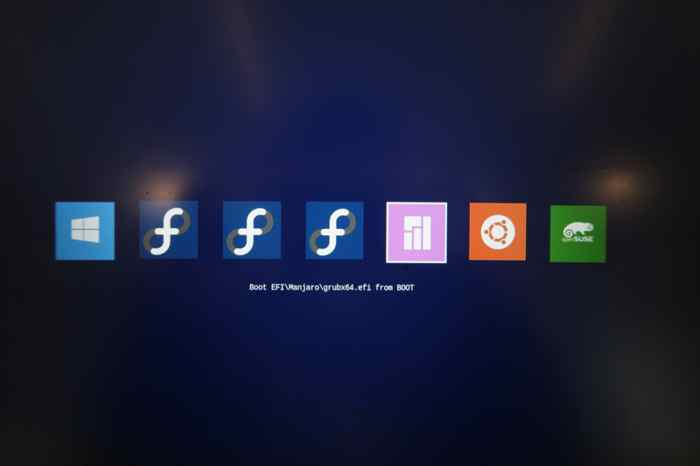

## Metro rEFInd theme

[rEFInd](http://www.rodsbooks.com/refind/) is a simplistic boot manager for UEFI
based systems. This is a clean and minimal theme for it.

### Usage

 1. Locate your refind EFI directory. This is commonly `/boot/EFI/refind` or `/boot/efi/EFI/BOOT` or `/boot/efi/EFI/refind` though it will depend on where you mount your ESP and where rEFInd is installed.

 2. Create a folder called `themes` inside it, if it doesn't already exist

 3. Clone this repository into the `themes` directory.

 4. To enable the theme add `include themes/rEFInd-Metro/theme.conf` at the end of
    `refind.conf`.

### Attribution

This is a fork of [refind-metro][fork].

I did small changes on several icons.

Below are attributions from the original rEFIND-metro.

The almost all of the OS icons, as well as the background are from [Metro for burg][icons] by [LuxieBlack][icon-author].

The rest of the icons are from [rEFInd-minimalist-black][other-icons] by
[Anders Fischer-Nielsen][other-icons-author] or are mofified versions of the default icons.

The layout to his README is based off of [rEFI-minimal][readme-base] by [Evan Purkhiser][readme-author]

[fork]: https://github.com/JohnTrentonCary/rEFInd-Metro

[icons]: http://luxieblack.deviantart.com/art/Metro-burg-theme-336505408
[icon-author]: http://luxieblack.deviantart.com/

[padster]: https://github.com/theRealPadster
[other-icons]: https://github.com/andersfischernielsen/rEFInd-minimal-black

[readme-base]: https://github.com/EvanPurkhiser/rEFInd-minimal
[readme-author]: https://github.com/EvanPurkhiser
[other-icons-author]: https://github.com/andersfischernielsen
